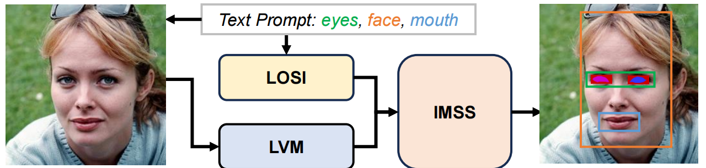

# Towards Small Target Segmentation under Guidance of Text Prompt in Open Scene

## Abstract
Vision-Language Joint Segmentation enhances the segmentation performance of visual models by leveraging powerful large-scale pre-trained natural language models and has recently attracted much research attention. Most current works provide additional supervision to visual segmentation models using large-scale pre-trained visual-text paired features, without addressing the gap between fundamental elements of visual and language models, especially when the target or complexity of the segmentation escalates. We introduce a groundbreaking paradigm, Lexical Operated Spatial Isolation (LOSI), and our bespoke Integrated Multimodal Segmentation Synthesizer (IMSS). LOSI strategically marries language priors with image segmentation, while IMSS innovatively infuses semantic cues from textual data into the segmentation process. This fusion is deftly orchestrated by Grounding DINO within the LOSI framework, thereby enhancing the model’s capability to accurately delineate instance-aware boundaries. Our approach also incorporates an Enhanced Visual Attention Modulated Depth Parser within IMSS, which markedly betters the precision of edge detail segmentation. This enhancement is further augmented by our Multi-scale Recursive Attention Segmentation Engine. The efficiency of our model is demonstrated through its training on a 30k mask dataset, requiring a mere 3.3 hours on 2 GPUs. Empirical evidence through extensive experimentation showcases our method’s superiority over current state-of-the-art techniques, particularly in eye semantic segmentation on the CelebA-HQ dataset. Here, our model achieves a groundbreaking 82.9% IoU, surpassing the previous best by 4.9% and breaking the 80% IoU threshold in this task for the first time. The code will be made publicly available as soon as possible.

## Authors
- Xingru Huang
- Kunyan CAI
- Tianyun Zhang
- Gaopeng Huang
- Yihao Guo
- Jian Huang
- Zhi Li

## Project Description
In the field of human cognition, the Sapir-Whorf hypothesis posits that language is not only a tool for communication but also forms the foundation of thought, encompassing human knowledge and logical reasoning. Large natural language models like GPT, trained extensively with natural language, demonstrate formidable semantic compression and understanding abilities. However, in computer vision, pixels as basic elements cannot achieve a similar understanding of world logic. With increasing computational power and model size, the performance of image supervision tasks is primarily constrained by datasets. Thus, integrating the world understanding of natural language models into visual tasks to break through dataset limitations becomes a key direction for enhancing image task performance and universality.

The prevailing method involves using models trained on large text-image pairings to provide rough supervision information for visual models. Despite numerous efforts to bridge text pre-trained models and visual models, the semantic elements of text and vision inherently differ, making establishing a paradigm between the basic elements of these two modalities crucial in multimodal segmentation. Recent work involves encoding language and images as Queries and establishing explicit associations between the two modalities through cross-attention mechanisms. However, these methods lack generalization capability in complex scenes and pixel-level segmentation precision. Human language stores rich knowledge accumulated by society, which could provide potential priors for training visual models.

To attempt to utilize these priors for image tasks, we propose the Lexical Operated Spatial Isolation paradigm, merging linguistic priors with visual tasks to optimize the performance of supervised learning models in image processing tasks as shown in Figure~\ref{fig: task}. We constructed an integrated system, Integrated Multimodal Segmentation Synthesizer (IMSS), where the isolator guides the semantic information of text prompts into the image segmentation process, enhancing the model's ability to capture global structures and detail information. Moreover, to tackle the challenges of complex image segmentation tasks, we developed the Augmented Visionary Attention Modulated Deep Resolver (AVAMDR), utilizing a Multi-Scale Recursive Attention Segmentation Engine and deep learning analytical modules to improve the model's detail recognition and segmentation capabilities for high-resolution images.

In summary, the main contributions of this study can be summarized as follows:
- Constructed a lexical operation spatial isolator to integrate the semantic information of text cues into the image segmentation process, and explored the application of language priors in image segmentation, thereby producing more accurate instance-aware bounding boxes.
- Innovatively proposes the Multi-Scale Recursive Attention Segmentation Engine for large-scale visual pre-training models (LVM), which not only supplements LVM's shortcomings in detail processing in specific fields but also takes advantage of its original semantic understanding and recognition of spatial and temporal connections to improve model performance.
- Exploiting a new image segmentation paradigm, Lexical operated spatial isolation. By combining prior knowledge in language models, we further improved the performance of tasks in these downstream domain-specific applications and achieved SOTA results on both hard and complex data sets.

## Experimental Results

Our proposed IMSS is compared with multiple state-of-the-art methods on the CelebA-HQ Mask dataset and the OD2P dataset. As shown in Table~\ref{tab:alldata} and Table~\ref{tab:celeb}, the IMSS system that uses language priors to strongly supervise the visual model achieves SOTA results in both data sets compared to previous SOTA models and is significantly ahead of the second-best model.

### CelebA-HQ Mask Dataset

In Table~\ref{tab:celeb}, the eye segmentation on the CeleA mask HQ dataset broke through the 80% IoU mark for the first time, which was 4.9% higher than the suboptimal model and reached IoU of 83.13% on the right eye and 82.17% on the left eye. This significant improvement is attributed to the adoption of language priors, which compensate for the lack of pixel-level understanding of visual models in complex scenes while avoiding the need for large-scale retraining.

### OD2P Dataset

On the OD2P dataset, as shown in Table~\ref{tab:alldata}, compared with the suboptimal model, the Dice index and IoU index are 1.6% and 3.0% higher, demonstrating the effectiveness of our approach in improving model performance.

### Visual Results

It can also be seen from Figures~\ref{fig:segment} and ~\ref{fig:celeba} that our IMSS model has produced impressive results under various unconventional eye conditions such as large-area eye occlusion and eye morphological changes caused by disease.

These results demonstrate the superior performance of our IMSS system in small target segmentation, especially in challenging scenarios.

Please refer to the respective tables and figures in this README for detailed numerical results and visual comparisons.

## License
This project is released under the [Your License Name] license.

## Note
The code for this project will be made publicly available soon.
